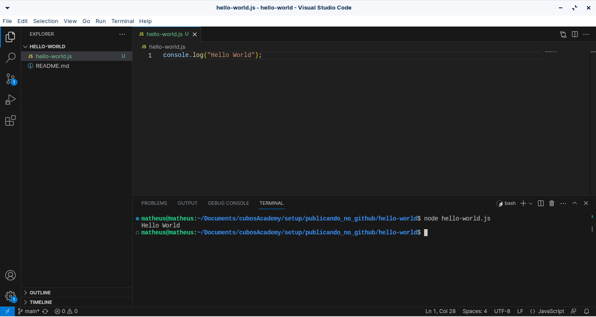

# Primeiro exercício da Cubos Academy

### Objetivos do exercício:

O objetivo deste exércicio foi por em prática a teoria ensinada sobre o básico do git, github, terminal e o visual studio code.

Também foi pedido o uso do comando do node para ver a saida do console.log do javascript.

E o que você esta lendo agora é o exercício extra de explicação do desafio no README.md